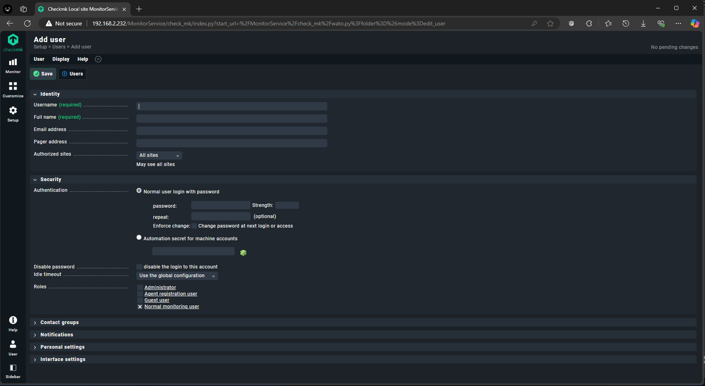

# Presentation of the Monitoring Project

## Log In
Once you've installed checkmk and got it running, when you open up the link, the page that will pop up is the one down below.

All you have to do is enter the admin username and admin password that was automaticly given to the user.
## Main Dashboard
When logged in succesfully, they automaticly send you to the main dashboard that contains basic information to help you manage hosts and their services.

You can also see the sidebar on the right contains all the navigational components for the website.
## Settings
The most important one is the settings tab that will allow you to go to the location where you manage hosts, agents and dashboards.

## CMK Dashboard
One of the dashboards given automaticly given to you by checkmk is the accuratly named "cmk dashboard". This dashboard show a summary of all the basic summaries needed to do basic survailance of everything.

But if you want to gain more details on specific services, then when you click the host's name it will show you the following.
## Services (Processes)
This is where it shows all of the services that can be used to monitor the systems. They are all laid out for you to be able to learn.

## Agents
This is the page where you download the agent so that your computer can be monitored.

## Hosts
These are some of the important pages for hosts
### Hosts Page 
This page can be used to see all the hosts you've created and their different properties.

### Add Hosts
This page can be used by one to create hosts so that you can have multiple computers all connected together.

## Users
These are some of the important pages for users
### Users Page
This is the function that decides where mygame is played or even fun in the slightest.

### Add Users
This page allows you to add a new user and give them the ability to give all of the guysa and

## Script
This is a showing of our script that shows the main computer (host of the website) an alertbox when there is someone logging in and they do not have the right data.

